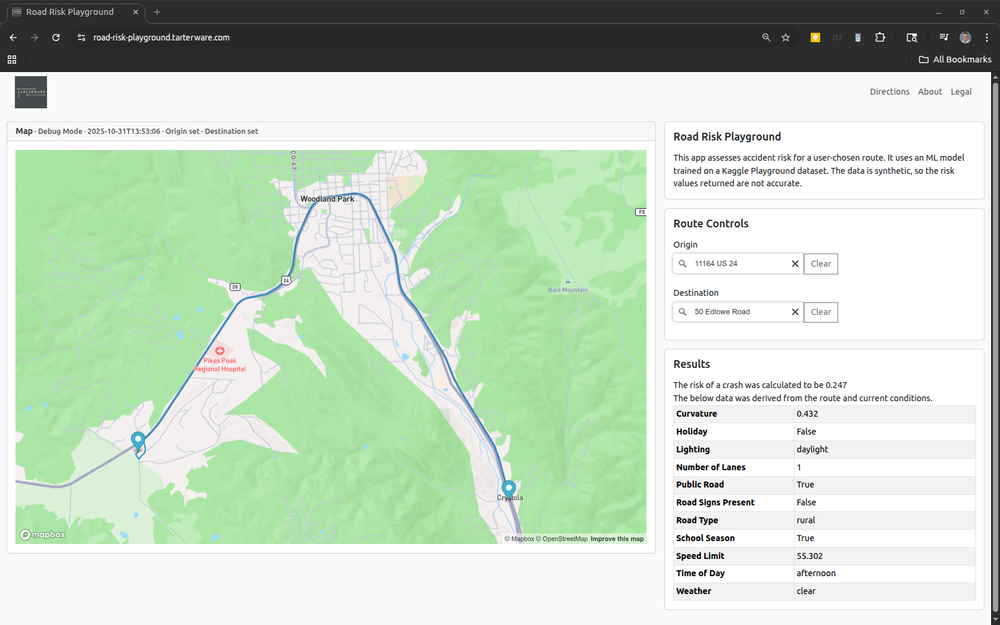

# Road Risk Playground

Road Risk Playground is a full-stack web application that estimates the relative likelihood of traffic accidents along a user-selected driving route. It combines a trained machine-learning model with live route, lighting, and weather data to produce an interpretable “risk score” for each trip.

## Background
The project was built in response to the Kaggle Playground competition, [Predicting Road Accident Risk](https://www.kaggle.com/competitions/playground-series-s5e10/overview), and its companion [Stack Overflow Challenge](https://stackoverflow.com/beta/challenges/79780240/kaggle-stack-overflow-two-part-challenge). While the Kaggle task focused on training the model, the Stack Overflow challenge extended it by requiring a working application that uses the model interactively.

## Try It
You can explore the live demo here:
https://road-risk-playground.tarterware.com/



## How It Works

### 1\. Front End
*   **Framework:** React + TypeScript + Mapbox GL JS
*   **Interaction:** Users pick origin and destination points directly on the map or enter street addresses.
*   **Data flow:** The app packages the coordinates, date, and time of travel, then calls the backend API.
*   **Display:** When results return, the route appears on the map with its computed risk score and the underlying model inputs in a details panel.

### 2\. Back End
*   **Platform:** AWS Lambda (Python 3) fronted by API Gateway.
*   **Routing data:** Mapbox Directions API provides geometry and road-class data.
*   **Feature extraction:**
    *   Curvature of each segment (derived from coordinate geometry).
    *   Number of lanes and functional class (street, primary, highway, etc.).
    *   Lighting conditions inferred from sunrise/sunset times at the route’s location and time.
    *   Weather features fetched from the U.S. National Weather Service API.
*   **Model inference:** A trained accident-risk model (from the Kaggle work) predicts a normalized risk value between 0 and 1.
*   **Response:** The API returns the route polyline, input variables, and the computed risk score to the front end.
    

### 3\. Infrastructure
Deployment is fully automated with **Terraform**, which provisions:
*   An **S3 static-site bucket** for the React build.
*   An **AWS CloudFront** distribution with HTTPS.
*   A **Lambda function** and **API Gateway** endpoint for inference.
*   Required IAM roles, Route 53 records, and environment configuration.

## Repository Layout
```bash
web/              React front-end source
lambda_python/    Python backend function
infra/            Terraform deployment code
Resources/        Screenshots and diagrams
```

## Status and Future Work
Planned enhancements include:
*   Route comparison mode (multiple alternate paths scored side-by-side).
*   More granular weather and traffic-volume features.
*   Continuous integration pipeline for automatic model updates.

